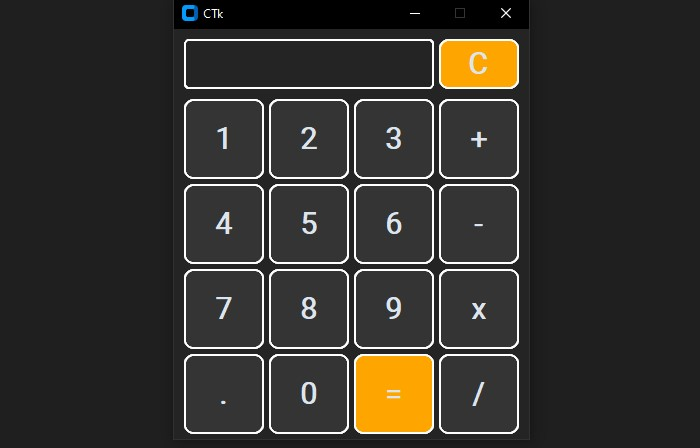

# 🧮 CustomTkinter Dark Calculator

A simple and modern dark-themed calculator built with Python and [CustomTkinter](https://github.com/TomSchimansky/CustomTkinter). It supports basic arithmetic operations and keyboard input.

## 🛠 Features

- Responsive GUI using `customtkinter`
- Keyboard input support
- Dark theme with styled buttons

## 📦 Requirements

- Python 3.7+
- customtkinter

